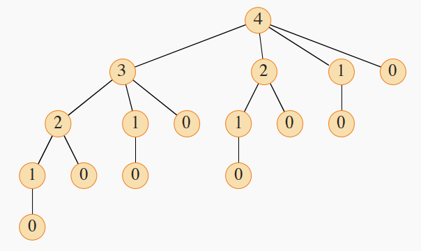

# Rod Cutting

### Problem Formulation
Given a rod of length $n$ inches and a table of prices $p_i$ for $i = 1, 2, ..., n$, where $i$ is the length of the wood, 

e.g.

| Length of Wood $i$ | Price|
| ------------- |:-------------:|
| 1| $p_1$|
| 2| $p_2$|
| 3| $p_3$|
| ...| ...|
| n| $p_n$|


determine the <font color = red>***maximum revenue $r_n$***</font> obtainable by cutting up the rod and selling the pieces. 

### Optimal Substructure
The optimal solution to a large problem is composed of optimal solutions to multiple smaller independent tasks.

In this case, we can decompose the problem in this manner:
$$r_n = \max{\{p_i + r_{n-i}:i\in[1,n]\}}$$

Here the solution to $r_n$ involves the solution to the subproblem $r_{n-i}$

###  Naive Recursive Solution

Without using dynamic programming, a naive solution is as follows:

```python
def cut_rod(p, n):
    ''' 
    p: the mapping between length and price
    n: the total length of a given rod
    '''

    if n == 0:
        return 0
    return max([p[i] + cut_rod(p, n-i) for i in range(1, n+1)])

```

The above tree shows all the function calls made when $n = 4$, where the number in a node is the value of the parameter $n$ in a function call.

Generally the number of function calls of such a tree can be expressed as 
$$T(n) = 1 + \sum_{j=0}^{n-1}T(j)$$
which is $2^n$, provable via simple math.

Another way to get a sense of the exponential running time is to think in terms of set theorem. For a rod of length $n$, there are $n-1$ possible locations to make a cut. Each unique way of cutting thus corresponds to a unique selection of some cutting locations among the $n-1$ options. By set theorem, there are $2^{n-1}$ subsets of a set of $n$ elements. 


### Dynamic Programming Solution

Dynamic programming eases the time complexity issue by allocating additional space to record the optimal solutions of subproblem. Therefore, <font color = red>***each subproblem is only solved once***</font>.

#### 1. Memoization
Memoization is a <font color = red>***top-down***</font> approach. It is almost the same as the naive solution, except it records previous calculation results.

```python
def cut_rod(p, n):
    ''' 
    p: the mapping between length and price
    n: the total length of a given rod
    '''
    r = {i:-1 for i in range(n+1)}
    return memoized_cut(p,n,r)

def memoized_cut(p, n, r):
    ''' 
    r: the mapping between length and corresponding subproblem solution
    '''
    if n == 0:
        return 0
    if r[n] >= 0:
        return r[n] # read MEMOIZED result
    
    r[n] = max([p[i] + memoized_cut(p, n-i, r) for i in range(1, n+1)])

    return r[n]

```

#### 2. Bottom-up
Solve smaller subproblems first, and build on their results to solve bigger ones.

```python
def cut_rod(p, n):
    ''' 
    p: the mapping between length and price
    n: the total length of a given rod
    '''
    r = {i:-1 for i in range(1, n+1)}
    r[0] = 0
    for i in range(1, n+1):
        r[i] = max([p[j] + r[i-j] for j in range(i+1)])
    return r[n]
```


